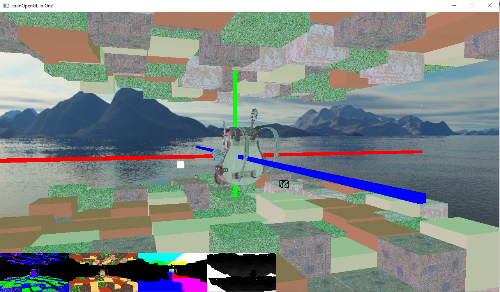

# Reading && Implementation
reference: [LearnOpenGL](https://learnopengl.com/)
# LearnOpengl in One

## Features
+ ECS Architecture
+ Forward Rendering 
+ Deferred Rendering
+ Forward Rendering after Deferred Rendering 
+ Direction\Point\Spot Light
+ Blinn-Phong Light Model
+ SkyBox

to be continue

## Screenshot

